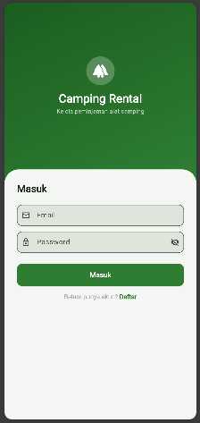
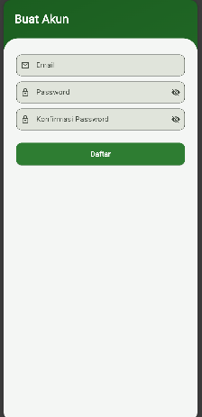
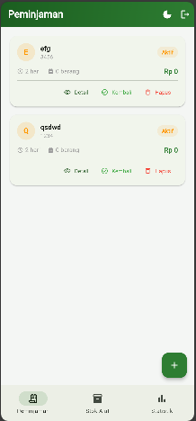
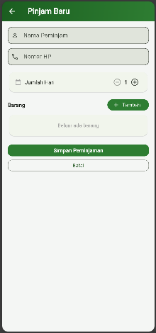
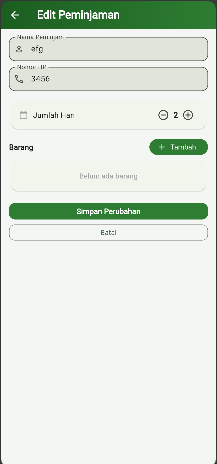
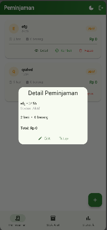
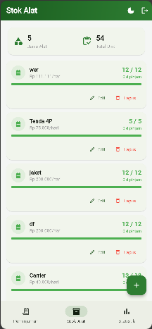
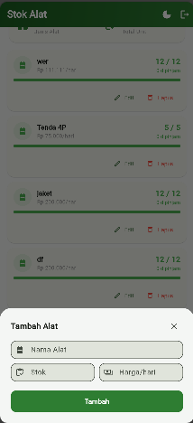
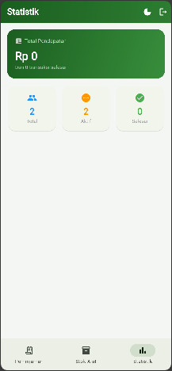
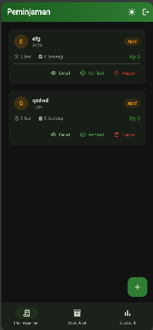

# Camping Rental App

Aplikasi mobile manajemen peminjaman alat camping berbasis Flutter yang terintegrasi dengan Supabase sebagai backend database dan autentikasi pengguna.

---

## Deskripsi Aplikasi

Camping Rental App adalah aplikasi yang dirancang untuk memudahkan pengelolaan peminjaman alat-alat camping. Aplikasi ini memungkinkan pengguna untuk mencatat data peminjam, memantau stok alat yang tersedia, serta melihat statistik pendapatan secara real-time. Seluruh data disimpan dan diambil dari database Supabase sehingga dapat diakses kapan saja.

---

## Fitur Aplikasi

### Autentikasi
Pengguna harus login terlebih dahulu sebelum menggunakan aplikasi. Tersedia fitur **Register** untuk membuat akun baru dan **Login** untuk masuk ke akun yang sudah ada. Setelah selesai menggunakan aplikasi, pengguna dapat **Logout** melalui tombol di pojok kanan atas. Autentikasi menggunakan Supabase Auth sehingga data pengguna aman dan terenkripsi.

<p align="center">
  
  
</p>

---

### Manajemen Peminjaman
Fitur utama aplikasi untuk mencatat data peminjaman alat camping. Mendukung operasi CRUD lengkap:

- **Tambah (Create)** — Menambahkan peminjaman baru dengan mengisi nama peminjam, nomor HP, jumlah hari, dan memilih alat yang dipinjam beserta jumlahnya. Estimasi total biaya ditampilkan secara otomatis.
- **Lihat (Read)** — Menampilkan seluruh daftar peminjaman beserta status, jumlah barang, dan total biaya. Tersedia tombol **Detail** untuk melihat rincian lengkap setiap peminjaman.
- **Edit (Update)** — Mengubah data peminjaman yang masih berstatus Aktif, termasuk nama, nomor HP, jumlah hari, dan barang yang dipinjam.
- **Hapus (Delete)** — Menghapus data peminjaman secara permanen dari database.
- **Kembalikan** — Menandai peminjaman sebagai **Selesai** ketika alat sudah dikembalikan, sehingga stok alat otomatis bertambah kembali.

<p align="center">
  
  
  
  
</p>

---

### Manajemen Stok Alat
Fitur untuk mengelola data alat camping yang tersedia. Mendukung operasi CRUD lengkap:

- **Tambah (Create)** — Menambahkan alat baru dengan mengisi nama alat, jumlah stok, dan harga sewa per hari.
- **Lihat (Read)** — Menampilkan seluruh daftar alat beserta informasi stok tersedia, jumlah yang sedang dipinjam, dan harga sewa.
- **Edit (Update)** — Mengubah data alat seperti nama, jumlah stok, dan harga sewa.
- **Hapus (Delete)** — Menghapus data alat secara permanen dari database.

Tersedia indikator visual berupa progress bar yang menunjukkan ketersediaan stok — **hijau** jika stok masih banyak, **oranye** jika hampir habis, dan **merah** jika stok habis.

<p align="center">
  
  
</p>

---

### Statistik
Menampilkan ringkasan data secara real-time meliputi:
- Total pendapatan dari transaksi yang sudah selesai
- Potensi pendapatan dari transaksi yang masih aktif
- Jumlah total transaksi, transaksi aktif, dan transaksi selesai

<p align="center">
  
</p>

---

### Light Mode & Dark Mode
Aplikasi mendukung dua tema tampilan yaitu **Light Mode** dan **Dark Mode**. Pengguna dapat beralih antara keduanya kapan saja melalui tombol di pojok kanan atas aplikasi.

<p align="center">
  
  
</p>

---

## Widget yang Digunakan

| Widget | Kegunaan |
|---|---|
| `GetMaterialApp` | Root aplikasi dengan dukungan GetX |
| `Scaffold` | Struktur dasar setiap halaman |
| `AppBar` | Header halaman dengan gradient |
| `NavigationBar` | Navigasi bawah antar tab utama |
| `IndexedStack` | Menampilkan halaman tab tanpa rebuild |
| `FloatingActionButton` | Tombol tambah data |
| `ListView` & `ListView.separated` | Menampilkan daftar data |
| `Card` | Tampilan item peminjaman dan stok |
| `LinearProgressIndicator` | Indikator stok alat |
| `BottomSheet` | Form tambah/edit alat |
| `TextField` | Input data form |
| `ElevatedButton` & `FilledButton` | Tombol aksi |
| `TextButton` | Tombol aksi sekunder |
| `CircleAvatar` | Avatar inisial nama peminjam |
| `Container` dengan `BoxDecoration` | Kartu statistik dengan gradient |
| `Obx` | Reactive UI dengan GetX |
| `RefreshIndicator` | Tarik untuk refresh data |
| `SnackBar` & `Get.snackbar` | Notifikasi pesan |
| `Get.defaultDialog` | Dialog konfirmasi |
| `SafeArea` | Area aman dari notch/status bar |
| `SingleChildScrollView` | Scroll pada form register |

---

## Teknologi yang Digunakan

- **Flutter** — Framework UI
- **GetX** — State management & navigasi
- **Supabase** — Database & autentikasi
- **flutter_dotenv** — Menyimpan konfigurasi environment (.env)

---

## Struktur Database Supabase

### Tabel `alat`
| Kolom | Tipe | Keterangan |
|---|---|---|
| id | uuid | Primary key |
| nama | text | Nama alat |
| stok | int | Jumlah stok total |
| harga | int | Harga sewa per hari |

### Tabel `peminjaman`
| Kolom | Tipe | Keterangan |
|---|---|---|
| id | uuid | Primary key |
| nama | text | Nama peminjam |
| hp | text | Nomor HP peminjam |
| hari | int | Jumlah hari sewa |
| kembali | bool | Status pengembalian |
| user_id | uuid | ID pengguna (foreign key) |
| created_at | timestamp | Waktu peminjaman |

### Tabel `peminjaman_items`
| Kolom | Tipe | Keterangan |
|---|---|---|
| id | uuid | Primary key |
| peminjaman_id | uuid | Foreign key ke peminjaman |
| nama_alat | text | Nama alat yang dipinjam |
| jumlah | int | Jumlah unit dipinjam |
| harga | int | Harga sewa per hari |

---

## Struktur Project

```
lib/
├── config/
│   └── supabase_client.dart
├── models/
│   └── models.dart
├── pages/
│   ├── auth/
│   │   ├── login_page.dart
│   │   └── register_page.dart
│   ├── home_page.dart
│   ├── form_page.dart
│   ├── peminjaman_card.dart
│   ├── stok_page.dart
│   └── statistik_page.dart
└── services/
    ├── auth_service.dart
    └── rental_service.dart
```
